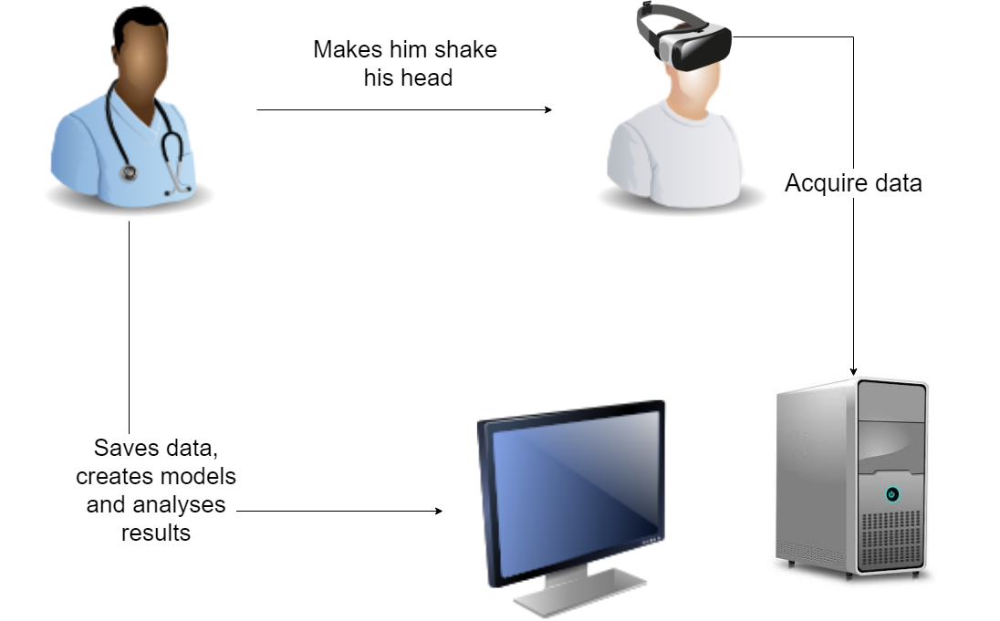

# Technical documentation - Developper Guide

Authors:
- Florian GARIBAL
- Guillaume HOTTIN
- Quentin JAUBERTIE
- Luc SAPIN
- François-Xavier STEMPFEL

## Introduction 
The Cervical Kinematic Recorder is an open-source software developped to acquire, display and analyse cervical movements thanks to an Oculus Rift headset. Cervical Kinematic Recorder was developed in the context of a last year project in the engineeing school E.N.S.E.E.I.H.T in colaboration with the Osteopathy Institute of Toulouse. This project was under the supervision of M. Denis Ducommun, Mme Sandrine Mouysset and M. Jérôme Ermont.

The overall process of the project is the following one:

## Setup the developpement environment

This project is made of two main components :

- The GUI that allows the operator to manage profiles, start and stop an acquisition, modify the parameters of the acquisition, generate models and visualize the acquired data. This will be referred as *Operator GUI* in this document.
- The application that runs in the Oculus Rift headset, displaying the 3D environment allowing to control the conditions of the acquisition and acquire the data from the headset. This will be referred as the *Oculus App* in this document.

### The Operator GUI

The Operator GUI part of the project is made in Python using PyQt as the graphical library. It was developped with **Python 3.6.2**.

To setup the whole developpement environment, you need several plugins that are used in the project. To install those libraries, you will need to use **pip 9.0.1** and enter the following commands in a shell :

- pip install numpy
- pip install PyQt5
- pip install scipy
- pip install sklearn
- pip install wheel
- pip install descartes
- pip install pyinstaller

Moreover, the library **Shapely 1.6.4** is needed. To install it on Windows, you need to go to the [following page](https://www.lfd.uci.edu/~gohlke/pythonlibs/#shapely) and download the correct file for your version of Python and architecture.
The files are named *Shapely‑1.6.4.post1‑cp**PYTHON_VERSION**‑cp**PYTHON_VERSION**m‑win32.whl* for the 32-bits version and *Shapely‑1.6.4.post1‑cp**PYTHON_VERSION**‑cp**PYTHON_VERSION**m‑win_amd64.whl* for the 64-bits version. To know which version of Python you use, open a terminal and run Python. It will display the version number and architecture on top of the Python shell.

Once you downloaded the correct **Shapely** file, open a terminal and navigate to the folder that contains it and type *pip install **NAME_OF_YOU_SHAPELY_FILE***.

After running all these commands, you should be able to open and run the Operator GUI project in the directory *projetlong/Cervical_GUI*.

For this Python project, we have been using *Pycharm*, available at [this page](https://www.jetbrains.com/pycharm/). A free *Community edition* is available, allowing to work with the project. Paid licenses are also available, and students can get all *Jetbrains* paid IDEs for free by registering on their website with the e-mail address their institution provided.

### The Oculus App

The Oculus App part of the project is made with Unity 2017.3.

To obtain Unity, you need to go to the [Unity homepage](https://unity3d.com/fr) and download it, using the *Personal Edition*.

Once it is installed, you should be able to open the Oculus App project under the directory *projetlong/Cervical*.

When in Unity, you can run the project by clocking the play button at the top. This allows to run it even without the headset plugged in, the camera won't move at all but you can check that the sphere behaves the way it should.

If you have the Oculus Rift headset, you will need to use the Oculus Store App, available at [this link](https://www.oculus.com/setup/).

After installing it, you should be able to plug the Oculus Rift headset and create an Oculus account. Once i is done, you can leave the store open. When you run the Unity project, it should display the scene in the Unity window and in the headset, moving the camera according to the Oculus headset movement.

To edit the scripts, we have been using *Visual Studio 2017* available at [this page](https://www.visualstudio.com/fr/downloads/). There is a free *Community edition* and paid versions available, but students can get it for free by registering on their website with the e-mail address their institution provided.

## Generating an executable project

To generate a distributable executable file, you need to build an executable file for the Oculus App first.
To do so, in Unity, open the project and then click on *File->Build Settings*. Select the correct build options :
- Target Platform : Windows
- Architecture : x86\_x64
- Copy PDB files : uncheck
- Development build : uncheck
- Compression method : Default

Then click on build. It will ask you for an output directory. Put it in *projetlong/Cervical_exe/*.

Once this is done, you can generate an executable file for the Operator GUI. We use *pyinstaller* for this, that you should have installed previously. You can check the documentation at [this page](https://pyinstaller.readthedocs.io/en/stable/usage.html).

Place yourself in the directory *projetlong/Cervical_GUI*. The main file of the project is *main.py*.

Generate a *spec* file by running *pyinstaller --onefile --icon="icone;
 
