# Technical documentation - Developper Guide

Authors:
- Florian GARIBAL
- Guillaume HOTTIN
- Quentin JAUBERTIE
- Luc SAPIN
- François-Xavier STEMPFEL

## Introduction 
The Cervical Kinematic Recorder is an open-source software developped to acquire, display and analyse cervical movements thanks to an Oculus Rift headset. Cervical Kinematic Recorder was developed in the context of a last year project in the engineeing school E.N.S.E.E.I.H.T in colaboration with the Osteopathy Institute of Toulouse. This project was under the supervision of M. Denis Ducommun, Mme Sandrine Mouysset and M. Jérôme Ermont.

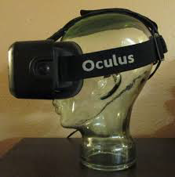

The overall process of the project is the following one:

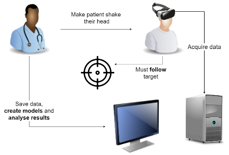

## Setup the developpement environment

This project is made of two main components :

- The GUI that allows the operator to manage profiles, start and stop an acquisition, modify the parameters of the acquisition, generate models and visualize the acquired data. This will be referred as *Operator GUI* in this document.
- The application that runs in the Oculus Rift headset, displaying the 3D environment allowing to control the conditions of the acquisition and acquire the data from the headset. This will be referred as the *Oculus App* in this document.

### The Operator GUI

The Operator GUI part of the project is made in Python using PyQt as the graphical library. It was developped with **Python 3.6.2**.

To setup the whole developpement environment, you need several plugins that are used in the project. To install those libraries, you will need to use **pip 9.0.1** and enter the following commands in a shell :

- pip install numpy
- pip install PyQt5
- pip install scipy
- pip install sklearn
- pip install wheel
- pip install descartes
- pip install pyinstaller
- pip install PyWavelets

Moreover, the library **Shapely 1.6.4** is needed. To install it on Windows, you need to go to the [following page](https://www.lfd.uci.edu/~gohlke/pythonlibs/#shapely) and download the correct file for your version of Python and architecture.
The files are named *Shapely‑1.6.4.post1‑cp**PYTHON_VERSION**‑cp**PYTHON_VERSION**m‑win32.whl* for the 32-bits version and *Shapely‑1.6.4.post1‑cp**PYTHON_VERSION**‑cp**PYTHON_VERSION**m‑win_amd64.whl* for the 64-bits version. To know which version of Python you use, open a terminal and run Python. It will display the version number and architecture on top of the Python shell.

Once you downloaded the correct **Shapely** file, open a terminal and navigate to the folder that contains it and type *pip install **NAME_OF_YOU_SHAPELY_FILE***.

To generate an executable file for the project, you will also need the *pycairo* library. You will need to install it the same way as *Shapely* by downloading it from [this page](https://www.lfd.uci.edu/~gohlke/pythonlibs/#pycairo). Make sure to download the right version for your python installation. Once you install it, run *pip install **DOWNLOADED_FILE***.

Finally, make sure that you installed *tkinter* when you installed Python. If this is not the case, run the Python installer for your version, chose *Modify* and check the box to install *Tcl/Tk and IDLE*.

After running all these commands, you should be able to open and run the Operator GUI project in the directory *projetlong/Cervical_GUI*.

For this Python project, we have been using *Pycharm*, available at [this page](https://www.jetbrains.com/pycharm/). A free *Community edition* is available, allowing to work with the project. Paid licenses are also available, and students can get all *Jetbrains* paid IDEs for free by registering on their website with the e-mail address their institution provided.

### The Oculus App

The Oculus App part of the project is made with Unity 2017.3.

To obtain Unity, you need to go to the [Unity homepage](https://unity3d.com/fr) and download it, using the *Personal Edition*.

Once it is installed, you should be able to open the Oculus App project under the directory *projetlong/Cervical*.

When in Unity, you can run the project by clocking the play button at the top. This allows to run it even without the headset plugged in, the camera won't move at all but you can check that the sphere behaves the way it should.

If you have the Oculus Rift headset, you will need to use the Oculus Store App, available at [this link](https://www.oculus.com/setup/).

After installing it, you should be able to plug the Oculus Rift headset and create an Oculus account. Once i is done, you can leave the store open. When you run the Unity project, it should display the scene in the Unity window and in the headset, moving the camera according to the Oculus headset movement.

To edit the scripts, we have been using *Visual Studio 2017* available at [this page](https://www.visualstudio.com/fr/downloads/). There is a free *Community edition* and paid versions available, but students can get it for free by registering on their website with the e-mail address their institution provided.

## Generating an executable project

To generate a distributable executable file, you need to build an executable file for the Oculus App first.
To do so, in Unity, open the project and then click on *File->Build Settings*. Select the correct build options :
- Target Platform : Windows
- Architecture : x86\_x64
- Copy PDB files : uncheck
- Development build : uncheck
- Compression method : Default

Then click on build. It will ask you for an output directory. Put it in *projetlong/Cervical_exe/*.

Once this is done, you can generate an executable file for the Operator GUI. We use *pyinstaller* for this, that you should have installed previously. You can check the documentation at [this page](https://pyinstaller.readthedocs.io/en/stable/usage.html).

Place yourself in the directory *projetlong/Cervical_GUI*. The main file of the project is *main.py*.

The script *main2exe.py* allows to automatically generate an executable file. Running *python main2exe.py* will generate *Cervical Kine Recorder.exe*. Keep in mind that generating it may take up to 10 minutes as it has to compile every library in use in the project.

Once everything is done, you should have the following files and folders:
- *Cervical Kine Recorder.exe*
- *Cervical.exe*
- *UnityPlayer.dll*
- *cervical_Data*

You can then copy them and move them in another folder. Running *Cervical Kine Recorder.exe* will then run the application.
 
 ## The Oculus App architecture
 
 The Oculus App is an Unity project. As such, it is composed of two main type of components :
 
 - The game assets
 - The scripts attached to the game assets
 
 ### The game assets
 
 The game assets present in the scene are as follows:
 - The elements making the room in which the patient is located : *Ground*, *BackWall*, *FrontWall*, *LeftWall* and *RightWall*
 - The camera through which the scene is viewed. It is located at the center of the room and can't be moved
 - The visual limits of the sphere movement: *LeftLimit* and *RightLimit*
 - The *Sphere* that is going to move
 - The UI elements, *Image* and *CountDownText*, grouped under a *Canvas* element.
 
 Moreover, there are two *empty* components in the scene: the *CameraParent* and the *Controller*.
 
 Those components are there to attach the scripts that are going to run.
 
 ### The scripts
 
 There are 8 scripts attached to the *Controller*. Those scripts are under the *Scripts* folder.
 - *CameraScripts/AcquireMovement.cs* : this script allows to get the rotation of the headset at each frame following the pitch, yaw and roll axis. To do this, it accesses the rotation data of the *Camera* object. When its public attribute *start* is set to *True*, it gets the data in a list every frame. When the *Sphere* stops at an angle, its *pause* attribute is set to *True* and it waits until the ball starts moving again to get the data. When the acquisition is finished, its *stop* attribute is set to *True*, and it writes this data in the temporary file *tmp.orpl*
 - *LimitsScripts/LimitsControlScript.cs* : this script receives the maximum angle of rotation of the sphere and places the visual limits accordingly in the scene
 - *SocketScripts/SocketClient.cs* : this script provides static methods that allow to connect to a remote socket server by giving the host and the port, send a message through this connection or receive a message through the connection.
 - *SocketScripts/ThreadedJob.cs* : this script is a small framework allowing to create simple threaded jobs by only having to inherit from it and implement two functions
 - *SocketScripts/SocketReceive.cs* : this script inherits the *ThreadedJob*. It waits ro receive a message through the socket connection and saves it in its public attribute *message* when it is received.
 - *SphereScripts/SphereColor.cs* : this script allows to change the color of the sphere depending of how far away the patient looks from it. If he is pretty close, the sphere will be green, if he is starting to deviate, it will be yellow and if it is too far away, it will be red. It does this by comparing the yaw angle of the sphere and the camera, as it is the only supported movement of this project for now.
 - *SphereScripts/SphereControl.cs* : this script takes care of all the logic behind the sphere movement. It gets all the parameters (sphere speed, maximum angle, number of come-and-go's, wait time at the extremums). When its *start* attribute is set to True, it starts the countdown. When the countdown is over, it move the sphere at the correct speed. When it reaches the left side for the first time, it tells the *AcquireMovement* script to start the acquisition and pauses it. It then waits the correct time at the left limit, and once it restarts moving, it tells the *AcquireMovement* script to unpause. It then moves to the other side and pauses the *AcquireMovement* script while it waits. It does so until the end of the acquisition. When it reaches the left side for the last time, it tells the *AcquireMovement* script to stop.
 - *StartScripts.cs* : this script is the one controlling all the logic of the application. When it is ran, it starts a socket server and waits to receive a *startAcquisition* message with all the correct parameters. Once it receives it, it sends a *startAcquisitionAck* message and attaches all the other scripts to the controller. It fills in all the parameters it receives to the correct scripts, and tells the *SphereControl* script to start its logic. From now on, the *StartScripts* script waits to receive either of two messages *stopAcquisition* or *finishAcquisition*. If it receives *stopAcquisition*, it stops the *SphereControl* script and sends a *stopAcquisitionAck* through the socket. If it receives *finishAcquisition*, it waits until the end of the acquisition. When it is finished, it sends *endAcquisition* through the socket.
 
 There is another script that is attached to the *CameraParent* : *PositionalLock*. This script allows to only get the rotational data from the Oculus headset. This ensure that even if the patient moves around in front of the computer, the camera stays centered in the middle of the room.
 
## GUI design 

In this part, the GUI design will be explained. You could find info about the architecure (package, functions, etc.) but also on the way that each window was design.

### Overall architecture

This application meets the MVC (Model-View-Controller) requirements. Thereby it has the following structure:

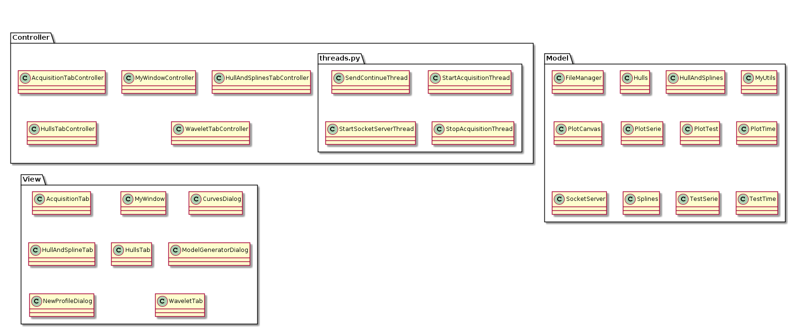

The three packages (Model, View and Controller) corresponds to the following things:
- *Model*: it contains functions about file managing (writing and reading files) but also all the mathematic function about modelling.
- *Controller*: it contains the logic that is behind each view. You have one controller per view (except for Dialog) that takes care of handling button clicked or other event that could occurs on a view.
- *View*: it contains all the GUI design itself. Thereby you will find there every button positionning, labels, layouts, etc.

#### Controller package

Here is the set of attribute and functions available through each file in the controller package. 

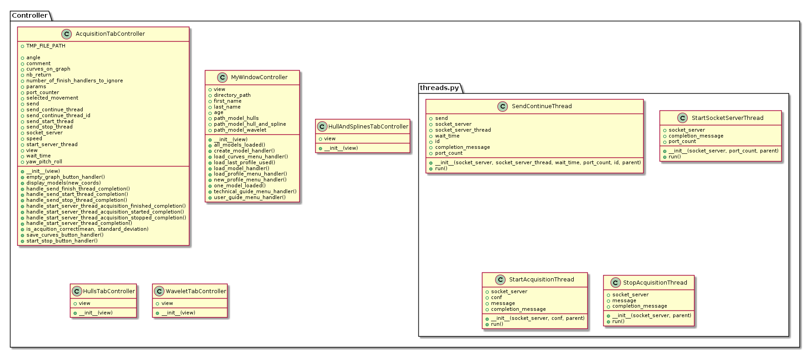

*You can click on the image to make it bigger and more readable*

#### Model package

Here is the set of attribute and functions available through each file in the model package. 

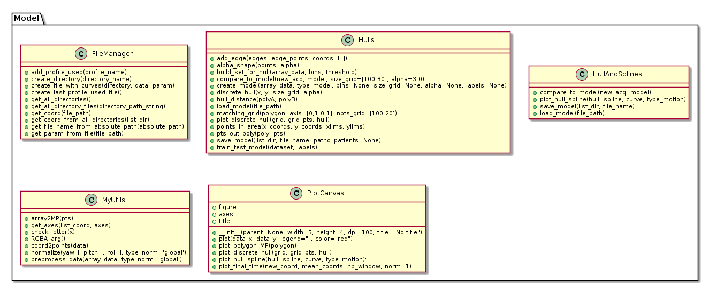

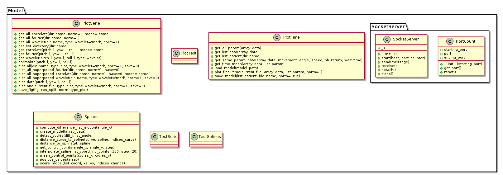

*You can click on the image to make it bigger and more readable*

#### View package

Here is the set of attribute and functions available through each file in the view package. 

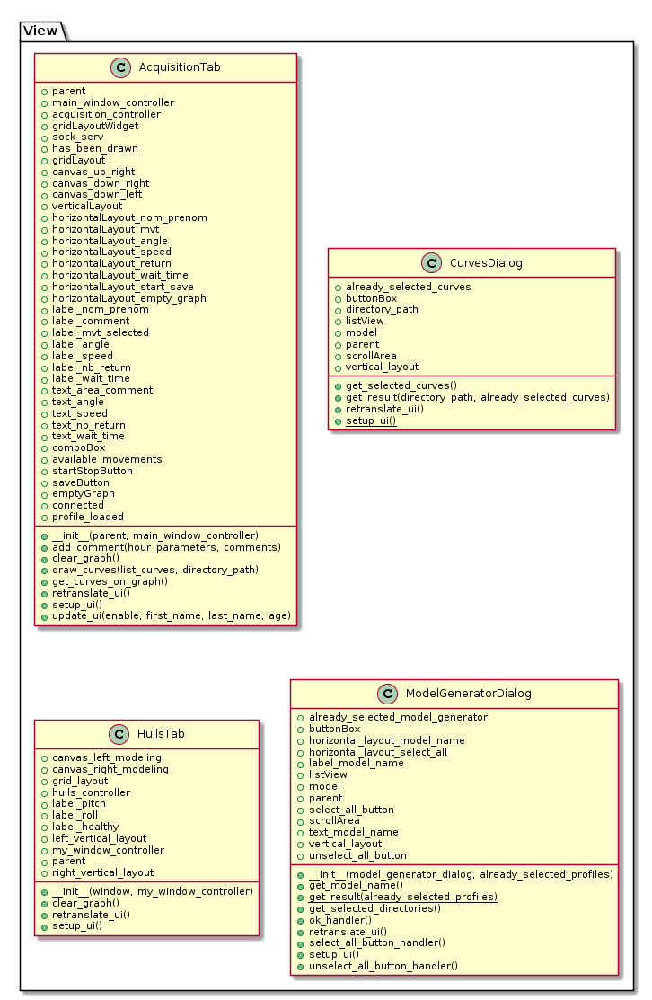

*You can click on the image to make it bigger and more readable*

### Design explanation

This part will explain how each view has been designed, how layouts are organised to help you in adding some stuff to the one you need to.

*You can find psd file to update the following schemas in the image folder*

##### Acquisition tab

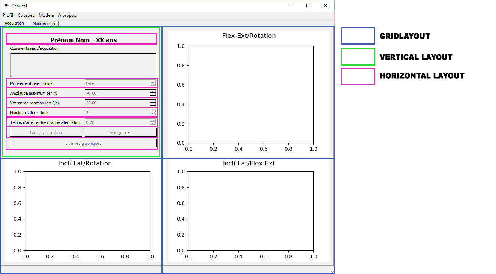

##### Hulls tab

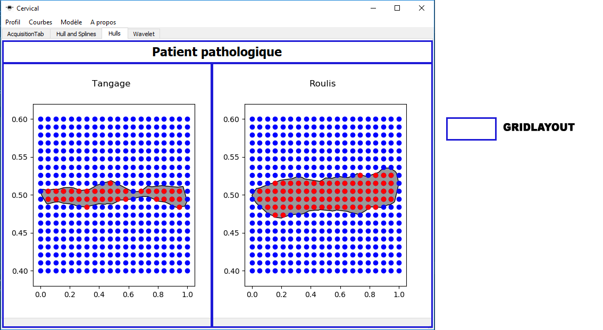

##### Hulls and splines tab

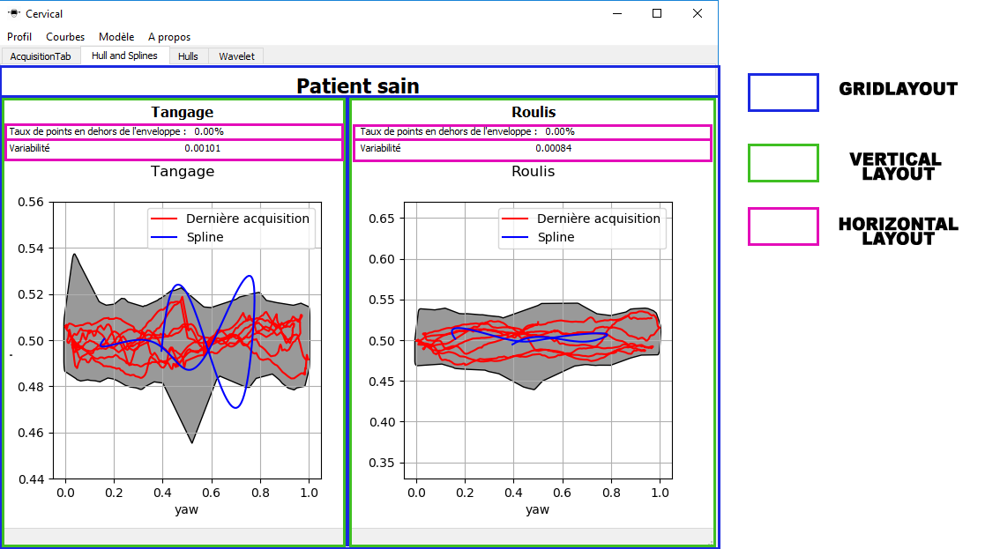

##### Wavelet tab

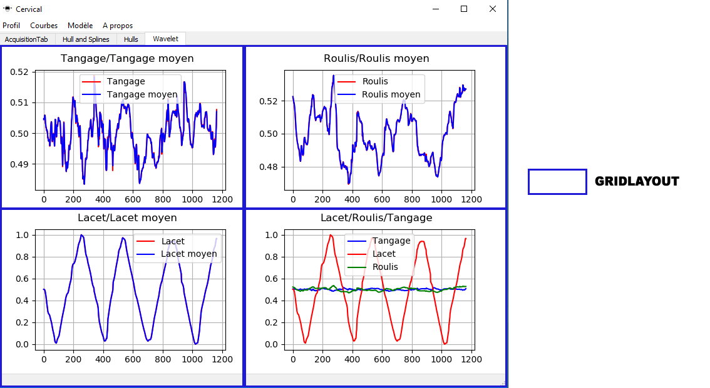

##### New profile dialog

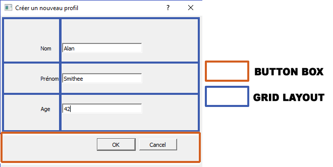

##### Load curves dialog

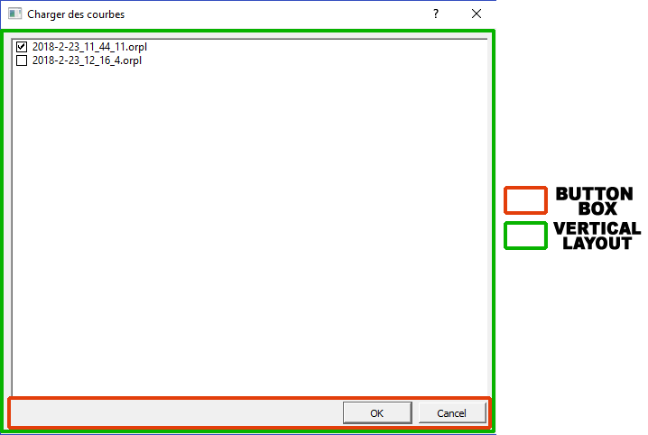

##### Create model dialog

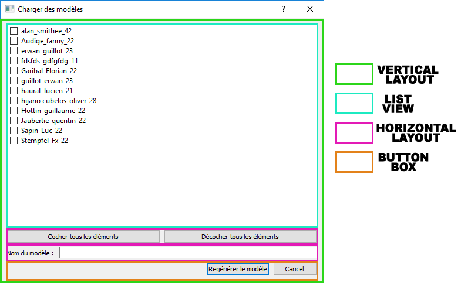

### Application constants 

In order to get every things working as expected, the application use some constants that are useful for file storage, URL links, defaults values, etc.
Here is the list of const and their meaning:

Constant name | Meaning | Default Value 
--- | --- | --- |
APP_ICON | The icon file used for the app| "./icone.ico"
LAST_PROFILE_USED_FILE_NAME | The file name where last profile used are stored | "last_profile_used.conf"
LAST_PROFILE_USED_LIST_LIMIT | The size of the last profile used list in the GUI | 5
FILE_EXTENSION                  | The file extension of acquired data | ".orpl"
PATH_TO_STORE_FILES             | The relative path where profiles data are stored | "./data/"
PATH_TO_STORE_MODELS            | The relative path where models files are stored | "./models/"
EXTENSION_HULLS_MODEL           | The file extension of hull model file | ".mdlhl"
EXTENSION_HULLS_SPLINES_MODEL   | The file extension of hull and splines model file | ".mdlhs"
EXTENSION_WAVELET_MODEL         | The file extension of wavelet model file |  ".mdlwvl"
USER_GUIDE_GIT_LINK         | The web link to the user guide | "https://github.com/guillaumehottin/CervicalKineRecorder/tree/master/Report/user_guide"
TECHNICAL_GUIDE_GIT_LINK    | The web link to the technical guide (the current guide) |  "https://github.com/guillaumehottin/CervicalKineRecorder/tree/master/Report/technical_guide"
INIT_ANGLE      |The default value for the target amplitude| 70.0
INIT_SPEED      |The default value for the target speed| 25
INIT_NB_RETURN  |The default value fot the number of target movements| 5
INIT_WAIT_TIME  |The default value for the extremum wait time| 0.2
COUNT_DOWN_TIME                 | The count down time at acquisistion start| "3"
SPHERE_GREEN_TO_YELLOW_ANGLE    | The distance threshold between **green** and **yellow** target color. The bigger the distance between user eyes position and target position, the bigger this difference will be |  "0.1"
SPHERE_YELLOW_TO_RED_ANGLE      |The distance threshold between **yellow** and **red** target color. The bigger the distance between user eyes position and target position, the bigger this difference will be| "0.2"
HOST |The IP address on which the GUI will send info through sockets. **This value shoud never be modified without changing Unity 3D socket settings**| "localhost"
PORT |The init port on which the GUI will send info through socket. **This value shoud never be modified without changing Unity 3D socket settings**| 50007

**All these constants are defined in the *const.py* file that you can find in *Cervical_GUI* folder**. 

They are imported into the file they are useful with the following line: **from const import \***. Then they are used only with their name, without any prefix.

### Debug mode, run without headset

In each file you will find a debug constant at the top. This constant is used to enable or disable some prints to help you debugging. You just have to swtich this constant to "**True**" to enable debugging mode.

If you do not have any headset available, you can still use the application (without having movement recording of course) for example to debug and test some functions. To do so you have to switch *acquisition_tab_controller* **DEBUG** constant to "*True*" and it will simulate an acquisition and allow you to launch one, compare with models etc. In fact what it is done is that when you switch *DEBUG* to *True* it will not retrieve data from "*tmp.orpl*" file but from "*tmp1.oprl*" instead which is in fact a static file use especially for debugging and simulating headset recording.

 
## Communication between the GUI and the Oculus App

The communication between the GUI and the Oculus App is done with sockets.

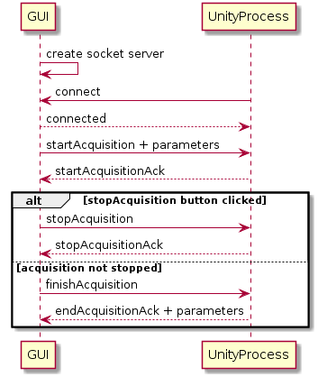

- The GUI creates the socket server and the Oculus App connects to it
- The GUI sends *startAcquisition,parameter1:value1,parameter2:value2...* to the Oculus app
- The Oculus app starts the acquisition and sends *startAcquisitionAck*
- Then there are two alternatives :
    - Either we want to stop and discard the acquisition and the GUI sends *stopAcquisition*
    - Either the operator wants to keep the acquisition and does nothing. Just before the end of the acquisition, the GUI sends *finishAcquisition*. The Oculus App then waits until the acquisition is finished and sends *endAcquisition,mean:value,standard_deviation:value*.

Once the acquisition is finished, the Oculus application writes the data in the file *tmp.orpl*.
The first line of the file is the header : "yaw pitch roll"
Then, every line is the data for yaw, pitch and roll in degrees for a frame.
Finally, the GUI gets the temporary file to get the data.

 ## Modeling and data analysis
 
 ### Hulls and Splines
 The file **Cervical_GUI/model/hull_and_spline.py** permits to:
  - Load, create and save the complete model with concave hulls and B-Splines,
  - Compare new data with model,
  - Plot measures.
  
 First, we build a mean concave hull of specified data. If new data is out of it (with some margin), we can say that new data correspond to unhealthy patient, else we study the variabilty of motion with B-Splines and compare it with a threshold.
  
 To use it, you need files **splines.py** and **hull.py**.
 
 #### Splines
 
The file **Cervical_GUI/model/splines.py** permits to:
 - Get angle data,
 - Interpolate curve with B-Splines (For instance, **Pitch=f(Yaw)**),
 - Compute the mean cycle of motion,
 - Compute the distance between data curve and mean cycle,
 - Create the model.
 
 First, we have to detect each cycle to develop the mean B-Spline. The main problem is that there are lots of small go-backs because the patient want to be aligned with the tracker. To avoid considering it, we use a system of window. In fact, for each points, we look at some points before and after and study their evolution (Function *detect_cycles*). 
 
 Then, We find the cycle with the lowest number of points, we reduce others cycle to have the same number of points and we mean all lists. It corresponds to the mean control points (Function *mean_control_points*). After that, it's possible to developp the mean B-Splines (Function *interpolate_spline*).
 
 Now, we have to study the variability and get a score. The difficulty is that B-Spline only represents one cycle so we have to consider each cycle and compare it with B-Spline. For each point within the data curve, we find the nearest one within the spline and compute the distance ||Point_1 - Point_2||. We return the mean and the standard deviation of all distances (Function *distance_curve_to_spline*). The returned score is not available for now because we have to find a threshold to decide if there is too much variability or not (Function *score_model*).
 
 To finish, the function *create_model* call *score_model* on specified patients and return all mean and standard deviation. This result is usefull to create hull_and_spline model.
 
 #### Hulls
 
 The file **Cervical_GUI/model/hulls.py** permits to:
  - Develop a concave hull
  - Compute distance between two hulls
  - Discretize a space ([0,1]x[0,1]) and find points in hull for classification
  - Compute train and test sets to have a score (classification)
  - Compute mean of concave hulls
  - Create/Save/Load a model of concave hulls
  
  In this part, we only consider the mean of concave hulls.
  
  The idea is to compute the mean of all concave hulls (Functions **build_set_for_hull** and **alpha_shape**). To do that, we don't consider union or intersection. We compute the density of points of all hulls in different areas. We only keep those which are in areas with high density. Then, for a new acquisition, we compute the pourcentage of points out of mean hull (Function **pts_out_poly**). If this number is higher than a threshold (0.1), the patient has a pathology.
  
 ### Classification of concave hulls
 
 Here, we use the other part of **hulls.py**.
 
 The idea is to consider a grid in [0,1]x[0,1]. For each patient, we compute the associated concave hull and we identify points in it. In this case, we assign to the points the value 1, else the value 0.
  
  
 ### Wavelets and B-Splines
 
The file *Code/spline_wavelet.py* permits to:

 - Get temporal data of Yaw, Pitch and Roll,
 - Interpolate curves **angle = f(t)** with B-Splines,
 - Build Morlet wavelets for each B-Spline,
 - Store all generated plots. Each figure contains two subplots:
   - The first one represents wavelets applied on B-SPlines,
   - The second one represents wavelets without interpolation. It's not usefull.

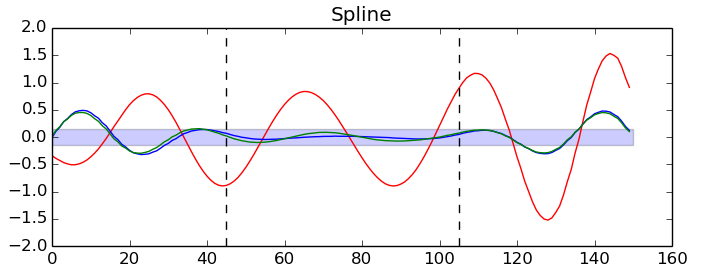 
                         
The red curve corresponds to **Yaw** angle, the blue curve to **Pitch** angle and the green to **Roll** angle.
This file was written at the end of project so it's not well structured. In fact, the biggest part of code is in the main of file. One idea to improve it is to create a function which take as feature a list of patients and compute Morlet wavelets for each angle.

Then, the number of control points (parameter **step**) for the spline and the type of wavelet (parameter **type_wave**) have been arbitrarily chosen so it's better to modify it and test.

To finish, for each plot, you can look at the central area (demarcated by two vertical lines) and see if the roll wavelet (green curve) is out of the rectangle. In fact, this phenomenon seems to appear when we have a pathological patient. To adjust the rectangle height, you need to modify the parameter **thres** in **Rectangle** function in **matplotlib.patches**. This height has also been arbitrarily chosen so you have to test and find its optimal value.
