# User documentation

Authors:
- Florian GARIBAL
- Guillaume HOTTIN
- Quentin JAUBERTIE
- Luc SAPIN
- François-Xavier STEMPFEL

## Introduction 
The Cervical Kinematic Recorder is an open-source software developped to acquire, display and analyse cervical movements thanks to an Oculus Rift headset. Cervical Kinematic Recorder was developed in the context of a last year project in the engineeing school E.N.S.E.E.I.H.T in colaboration with the Osteopathy Institute of Toulouse. This project was under the supervision of M. Denis Ducommun, Mme Sandrine Mouysset and M. Jérôme Ermont.

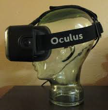

The overall process of the project is the following one:

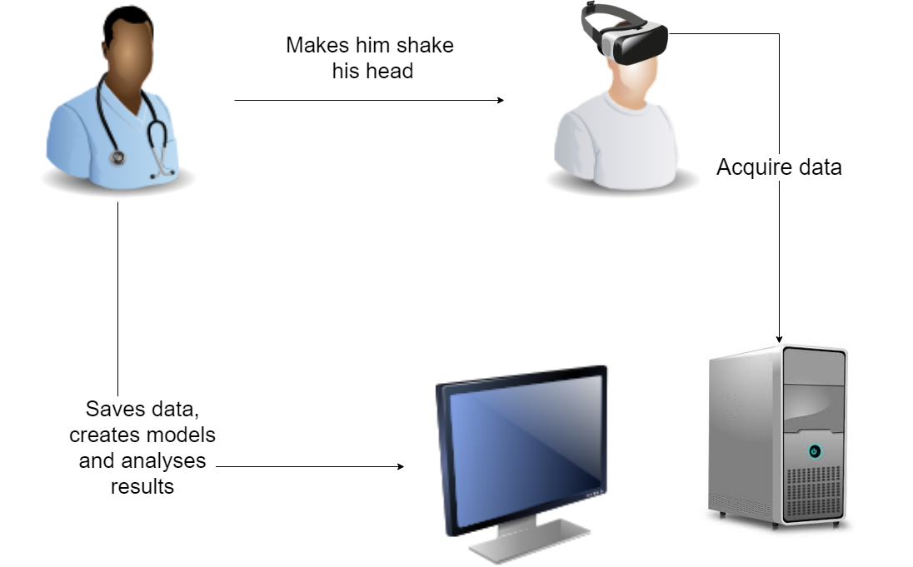

## Setup environment and start application

The installation process is divided in two parts: Oculus Rift headset configuration and then the main app (CervicalKineRecord) set up.

In order to get the application running as well as expected and especially the Oculus Rift headset, it is necessary to use a computer that meets the following requirements:

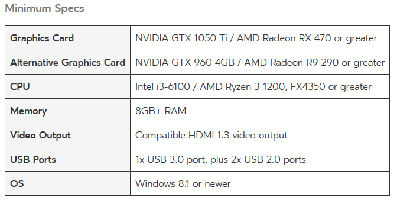
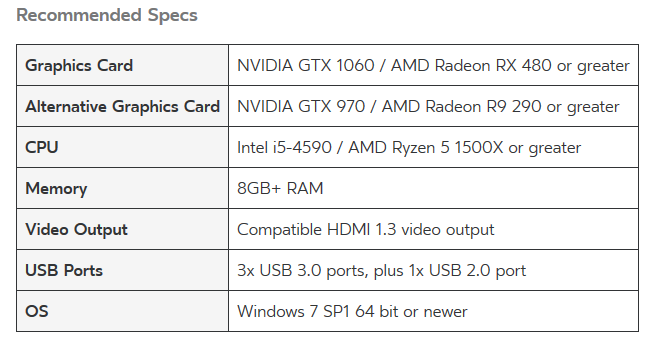

Secondly, it is necessary to have an Oculu account. If it is not the case yet, you can create one at this address: [https://auth.oculus.com/login/](https://auth.oculus.com/login/)

### Setup environment

In a first time, it is necessary to download the *Oculus* application that allows you to use the headset on your PC.
This application is available at this address: [https://www.oculus.com/setup/](https://www.oculus.com/setup/)

As soon as the download is finished, it is time to plug in the headset to your computer ! 
You will need to follow these steps:
- Put the sensor (similar to a webcam) on top of your screen in front of you
- Plug in the sennsor to a 2.0 or 3.0 USB port of your computer
- Plug in the headset USB port to a 3.0 USB port of your computer
- Plug in the HDMI cable to the HDMI port of your computer (if your computer have more than one HDMI port, use the one of the graphic card)

In order to check if the headset is well plugged, the lights on the headset and the sensor should be orange/yellow.

It is now time to launch the Oculus Application in order to connect the headset. Log you in on the application with your Oculus ID (if you do not have any account, please create one there: [https://auth.oculus.com/login/](https://auth.oculus.com/login/))
At this stage, the two lights (headset and sensor) should be blue and a menu should be displayed inside the headset.

If everything is working, you have just finish the environment setup, otherwise try again or look for your specific problem on Google or on the Oculus forum.

### Install the CervicalKineRecords Application

In order to install the application on your computer, you just need to get the latest release available on the current git repository. 
This release should contains: 
- The exe file "CervicalKineRecord.exe"
- TODO

### Start application

Starting the application is very simple ! You just need to run the *exe* file called "*CervicalKineRecord.exe*".
Then, the application should start and you should have two distincts windows:
- The window that displays the target seen inside the headset
- The window that allows you to setup the parameters, launch an acquisition and see the results.

*Optionnal:*
To access the app easily, you can create a desktop shortcut with the following operation:

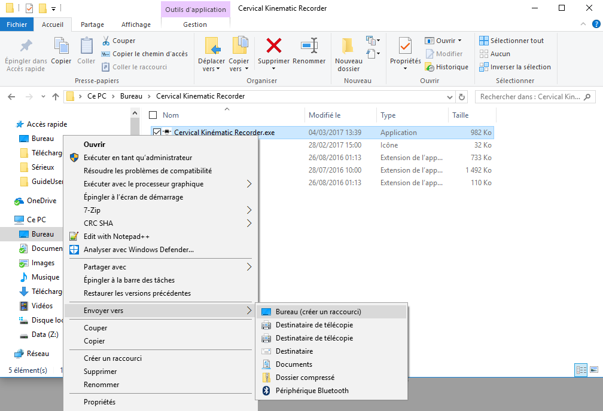

At this stage, all the preliminary steps is done, you can now go to the next section to learn how to use the application.

# Tutorial

In order to not have unexpected behaviours, be sure to have done all the preliminary steps in the previous section "*Setup environment and start application*".

## Application overview and vocabulary

Here is an screenshot showing how the computer screen should be after the application starting.

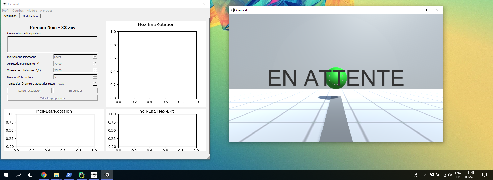

We are now goint to define all the terms we are going to use in this tutorial 

### Vocabulary 

- Unity3D window: this windows allows you to see everythin that is displayed inside the headset and therefore follow the user movements.

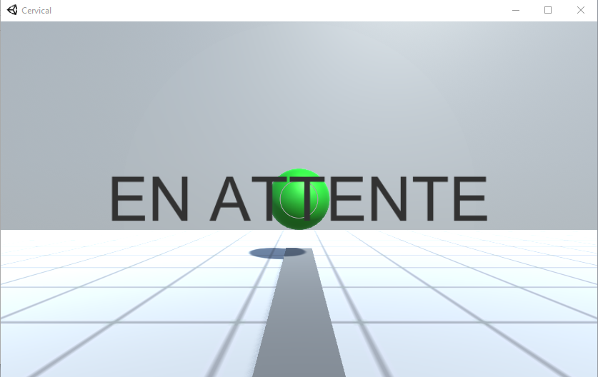

- Application window: This window allows you to manipulate profiles, set up parameters, launch/stop acquistion and analyse results throught the modelization tab

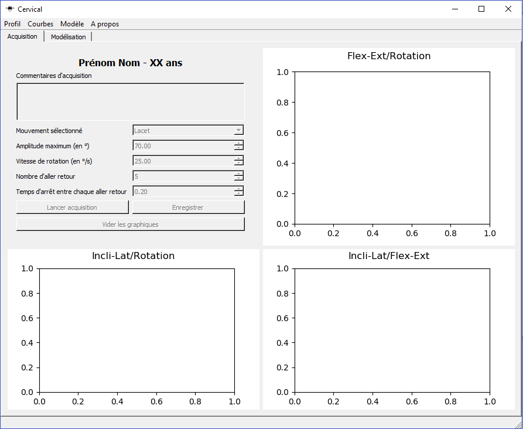

- Acquisition tab: This tab allows you to set up parameters, launch/stop acquisition and see the acquired curves (see image above)

- Modelization tabs: TODO
 
- Menu bar: The menu bar is composed of four entries :

	-- "Profil": Create, load or opena  recent profile
	-- "Courbes": Load saved curves
	-- "Modèles": Create or load a model according to selected patients
	-- "À propos": Application documentation

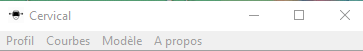

### Functionnalities

#### Create a profile
    
To create a profile, you need to go to the "*Profil*" menu bar entry and then click on "*Nouveau profil*". From there, a new dialog will appear to enter the patient details (last name, first name, age)
These details should follow the following rules:
- **Last name**: text without any space, number, or special characters (~, ", ', (, -, è, \_, ç, @, =, +, \$, ...)
- **First name**: text without any space, number, or special characters (~, ", ', (, -, è, \_, ç, @, =, +, \$, ...)
- **Age**: number greater or equals to zero

**WARNING:** None of this details should be empty ! You should put a value, even without any sense, in each field.

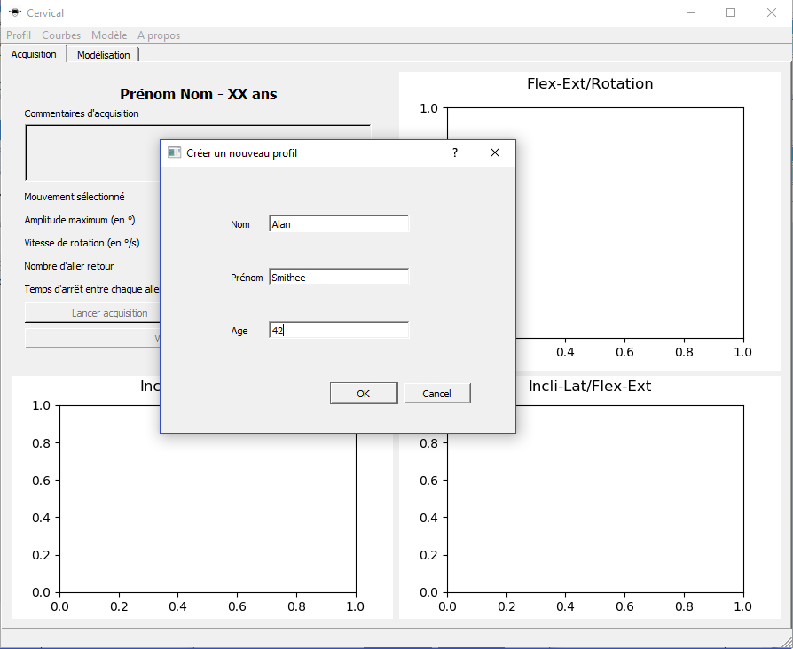

**WARNING:** At this stage, the app does not accept people with same last name, first name AND age. If you try to create a profile with exact same details as one that already exists, you will face the following window.

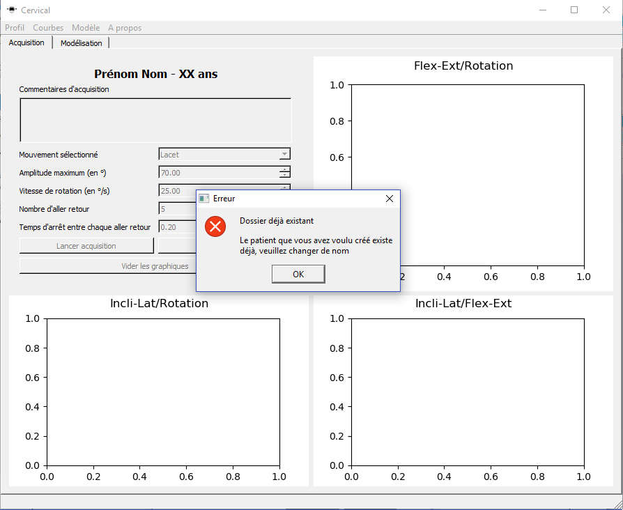

#### Load a profile

To load a profile you need to the "*Profil*" menu bar entry and then click on "*Charger un profil*". From there, a new dialog will appear to select the patient folder you want to load.
This folder name should meet the following requirements: *\<NomPatient\>*\_*\<PrénomPatient\>*\_*\<ÂgePatient\>*
    
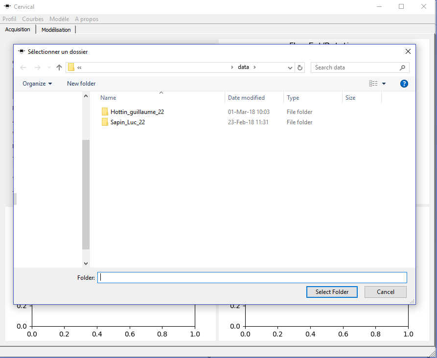

When the patient is loaded well, his details (last name, first name, age) should be displayed in the application window. You can now display his saved curves, set up and launch an acquisition.

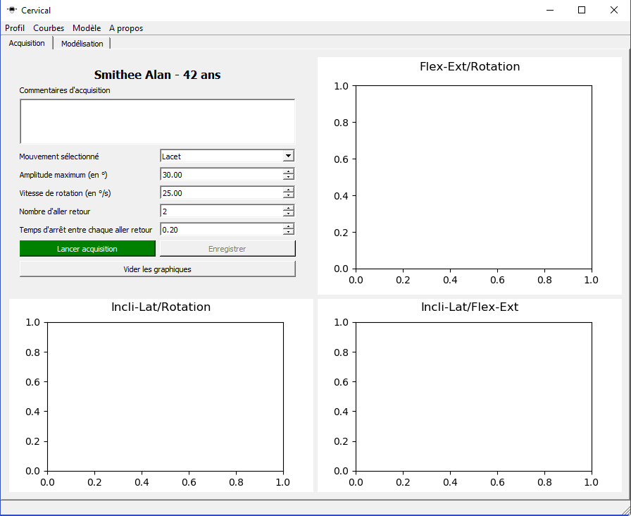

**WARNING:** If you try to load a profile that is already loaded in the application, a dialog will show up to inform you about it and nothing will be done. Indeed, in order to avoid any confusion between profiles, this actions is not possible.

#### Load a recent profile
To load a profile you need to the "*Profil*" menu bar entry and then click on "*Charger un profil récent*". From there, a list of last profiles loaded will be displayed and you just have to choose one of them.
When the patient is loaded well, his details (last name, first name, age) should be displayed in the application window. You can now display his saved curves, set up and launch an acquisition.

**WARNING:** You should never, under none excuses, modify a patient folder name neither create one by yourself. You shoul only use the application to manipulate profiles.

#### Load one or more curves 

**To load one or more curves you first need to create or load a profile**. Then, you need to the "*Courbes*" menu bar entry and then click on "*Charger courbes*". From there, a new window will appear containing a list of all the available curves for this profile.

You can select as much curves as you want but you need to know that they will all be displayed in the three graph of the acquisition tab. On the other hand each commentary corresponding to the loaded curves will be displayed in the comment area (top left of the application window) with the same legend as the curve in the graph. It sounds good to not display more than 5 or 6 curves at the same time.
If you want to *change the displayed curves*, you just need to go bac to the same menu as before and un-select the one you do not want anymore.
If you want to empty all the graph, you just have to click on the "Vider les graphiques" button and confirm (or infirm if you want to cancel) your operation.
In case the displayed color cannot be distinguishable well, you can re-open the "Selectionner courbes" dialog, keep the same curves selected and confirm your action. The curves will not be changed, ony their displayed colors.

#### Do an acquisition

**To do an acquistion you first need to create or load a profile**. 
Then, you can set up the following parameters as you want:

Name | Type (unit) | Description | Ideal values
--- | --- | --- | --- 
Comment | Text | Info that could be useful to know about the acquisition (conditions, pathology, ...) | -  
Type of movement | Lacet/Roulis/Tangage | Type of movement that will be done by the patient  | Lacet 
Rotation speed | Number (°/s) | The displayed target speed  | 20-40°/s  
Max angle | Number (s) | The maximum angle the target will go  | 60-90°  
Number of return | Number | The number of "come and go", round trip the target will do  | 3-7  
Extremum wait time | Number (s) | The number of seconds that the target will wait at its maximum angle. |0.20-0.35s

**WARNING:** Only the "Lacet" movement is now supported by the headset application. You can select other movement but the target will not help you doing this kind of movement. That means that parameters for other movements than "Lacet" are not useful at all.
    
After setting up the acquisition as you wanted, you just have to put the headset on your patient head and click on the "*Lancer acquisition*" button. Following this, a countdown will be displayed inside the headset and the acquistion will start.

At the end of the acquisition two cases are possible:
- **The patient followed well the target**, data are retrieved from the Oculus Rift headset and displayed on the three graph on the acquisition tab and also compared on the modelization tabs.

- ** The patient did not follow the target well enough**. In this case the following window will appear to inform you about the problem. And you will have to choose if you want to keep this data anyway or stash them. If you accept  you will be in the same state as in the first case.

# TODO ADD SCREENSHOT KEEP OR STASH DATA

**When the curve is displayed on all the graph, it is not saved yet**!
You must click on the "Enregistrer la courbe" button to save the curves retrieved after the acquisition process

On the other hand, you can interrupt at anytime the acquisition in order to change the parameters or just cancel your operation. The acquired data will not be displayed neither saved.

#### Mathematic modelization

#### Create a model

#### Load a model

#### Documentation

 