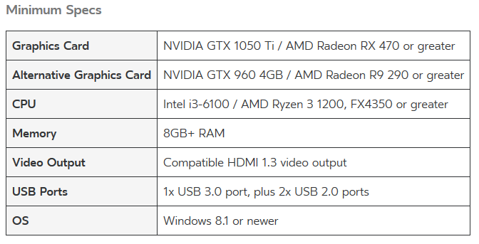

# User documentation

Authors:
- Florian GARIBAL
- Guillaume HOTTIN
- Quentin JAUBERTIE
- Luc SAPIN
- François-Xavier STEMPFEL

## Introduction 
The Cervical Kinematic Recorder is an open-source software developped to acquire, display and analyse cervical movements thanks to an Oculus Rift headset. Cervical Kinematic Recorder was developed in the context of a last year project in the engineeing school E.N.S.E.E.I.H.T in colaboration with the Osteopathy Institute of Toulouse. This project was under the supervision of M. Denis Ducommun, Mme Sandrine Mouysset and M. Jérôme Ermont.

## Setup environment and start application

The installation process is divided in two parts: Oculus Rift headset configuration and then the main app (CervicalKineRecord) set up.

In order to get the application running as well as expected and especially the Oculus Rift headset, it is necessary to use a computer that meets the following requirements:

Secondly, it is necessary to have an Oculu account. If it is not the case yet, you can create one at this address: [https://auth.oculus.com/login/](https://auth.oculus.com/login/)

### Setup environment

In a first time, it is necessary to download the *Oculus* application that allows you to use the headset on your PC.
This application is available at this address: [https://www.oculus.com/setup/](https://www.oculus.com/setup/)

As soon as the download is finished, it is time to plug in the headset to your computer ! 
You will need to follow these steps:
- Put the sensor (similar to a webcam) on top of your screen in front of you
- Plug in the sennsor to a 2.0 or 3.0 USB port of your computer
- Plug in the headset USB port to a 3.0 USB port of your computer
- Plug in the HDMI cable to the HDMI port of your computer (if your computer have more than one HDMI port, use the one of the graphic card)

In order to check if the headset is well plugged, the lights on the headset and the sensor should be orange/yellow.

It is now time to launch the Oculus Application in order to connect the headset. Log you in on the application with your Oculus ID (if you do not have any account, please create one there: [https://auth.oculus.com/login/](https://auth.oculus.com/login/))
At this stage, the two lights (headset and sensor) should be blue and a menu should be displayed inside the headset.

If everything is working, you have just finish the environment setup, otherwise try again or look for your specific problem on Google or on the Oculus forum.

### Install the CervicalKineRecords Application

In order to install the application on your computer, you just need to get the latest release available on the current git repository. 
This release should contains: 
- The exe file "CervicalKineRecord.exe"
- TODO

### Start application

Starting the application is very simple ! You just need to run the *exe* file called "*CervicalKineRecord.exe*".
Then, the application should start and you should have two distincts windows:
- The window that displays the target seen inside the headset
- The window that allows you to setup the parameters, launch an acquisition and see the results.

*Optionnal:*
To access the app easily, you can create a desktop shortcut with the following operation:

At this stage, all the preliminary steps is done, you can now go to the next section to learn how to use the application.
